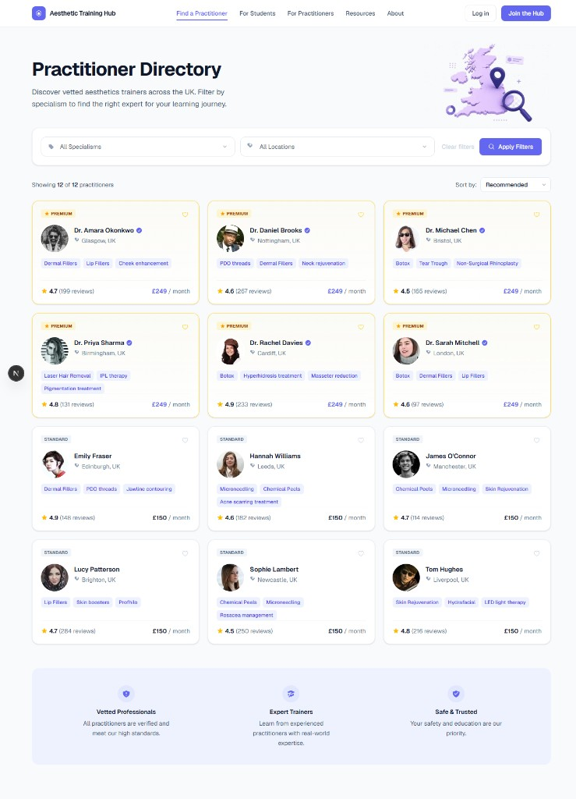

# Aesthetic Training Hub

A modern SaaS-style practitioner directory built with Next.js, TypeScript, and Tailwind CSS. Browse vetted UK aesthetic trainers, filter by specialism and location, and explore premium vs standard practitioner listings.



## Setup

```bash
npm install
npm run dev
```

Open [http://localhost:3000/practitioners](http://localhost:3000/practitioners) to view the directory.

### Additional scripts

| Command         | Description                  |
| --------------- | ---------------------------- |
| `npm run build` | Create a production build    |
| `npm run start` | Serve the production build   |
| `npm run lint`  | Run ESLint                   |

## What was built

### Practitioner directory page

A full `/practitioners` page with:

- Navbar, hero section, and features footer
- Responsive practitioner grid (1 / 2 / 3 columns)
- Sort control (recommended, name, location)
- Clean SaaS marketplace styling with soft shadows and rounded cards

### Filtering system

Client-side filtering via `FilterBar` and `PractitionerDirectory`:

- **Specialism** dropdown — filter by treatment type
- **Location** dropdown — filter by UK city
- **AND logic** — results must match both filters when both are set
- **Clear filters** — reset selections and show all practitioners
- Dynamic results count (`Showing X of 12 practitioners`)

### Premium highlighting system

Premium practitioners are visually distinguished on `PractitionerCard`:

- Gold/amber border and subtle background tint
- **PREMIUM** badge with star icon
- Verified checkmark on profile name
- Purple-accent pricing (`£249 / month` vs `£150 / month` for Standard)
- Premium practitioners sorted first when using the recommended sort

### Mock dataset

12 practitioners in `data/practitioners.ts`, including:

- Name, location, tier (`Premium` / `Standard`), specialisms, and avatar image
- Mix of UK cities and aesthetic specialisms for realistic filtering demos

## What was NOT included

This is a front-end prototype only. The following were intentionally left out:

- **No backend / database** — all data is static and loaded from a local TypeScript file
- **No authentication** — Log in / Join the Hub buttons are UI placeholders only
- **No APIs** — no external services, REST endpoints, or server-side data fetching

## Tech stack

- [Next.js 16](https://nextjs.org) (App Router)
- [React 19](https://react.dev)
- [TypeScript](https://www.typescriptlang.org/)
- [Tailwind CSS 4](https://tailwindcss.com/)

## Project structure

```
aesthetic-training-hub/
├── app/
│   ├── practitioners/page.tsx   # Directory page
│   ├── globals.css
│   └── layout.tsx
├── components/
│   ├── PractitionerCard.tsx       # Card with premium highlighting
│   ├── PractitionerDirectory.tsx  # Grid, sort, and filter results
│   ├── FilterBar.tsx              # Specialism & location filters
│   └── practitioners/             # Hero & features sections
├── data/
│   └── practitioners.ts           # Mock dataset (12 practitioners)
├── lib/                           # Filtering, sorting, display helpers
└── docs/images/                   # Screenshots
```
